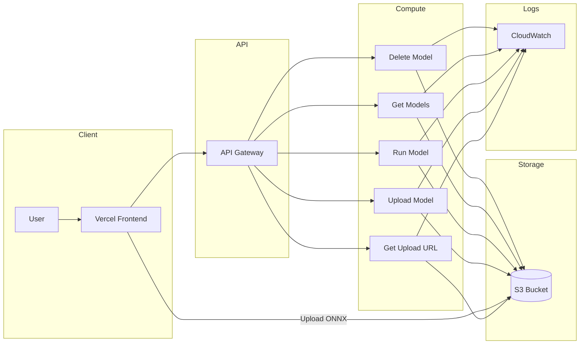

# 🚀 AI Model Hosting & Execution Platform (AWS Serverless)

A fully serverless platform to **upload, store, manage, and run ONNX machine learning models** using AWS.  
It allows users to deploy ML models as APIs without managing infrastructure.

---

## 🧠 Architecture Overview



---

## 📦 Features

- Upload ONNX models using pre-signed URLs  
- Store models securely in S3  
- Run models via API (serverless inference)  
- Fetch all user models  
- Delete models anytime  
- Logging via CloudWatch  
- Fully serverless and scalable  

---

## 🔗 API Endpoints (Full URLs)

### 📤 Get Upload URL
**GET**
```
https://quqjmkt1sc.execute-api.us-east-1.amazonaws.com/prod/get-upload-url
```

---

### 📥 Upload Model
**POST**
```
https://quqjmkt1sc.execute-api.us-east-1.amazonaws.com/prod/upload-model
```

---

### 📄 Get User Models
**GET**
```
https://quqjmkt1sc.execute-api.us-east-1.amazonaws.com/prod/models/{userid}
```

---

### ▶️ Run Model
**POST**
```
https://quqjmkt1sc.execute-api.us-east-1.amazonaws.com/prod/run-model/{userid}/{modelid}
```

---

### 🗑️ Delete Model
**DELETE**
```
https://quqjmkt1sc.execute-api.us-east-1.amazonaws.com/prod/models/{userid}/{modelid}
```

---

## 🔄 Workflow

1. Call `/get-upload-url`  
2. Upload `.onnx` file to S3 using the returned URL  
3. Register model via `/upload-model`  
4. Fetch models via `/models/{userid}`  
5. Run model via `/run-model/{userid}/{modelid}`  
6. Delete model when needed  

---

## ⚙️ Tech Stack

- AWS Lambda  
- Amazon S3  
- API Gateway  
- CloudWatch  
- Vercel  
- ONNX Runtime  

---

## 🔐 Security

- Pre-signed URLs for secure uploads  
- IAM roles for controlled access  
- API Gateway for endpoint protection  

---

## 📊 Monitoring

- CloudWatch logs for all Lambda executions  
- Error tracking and debugging  

---

## 🚧 Future Improvements

- Authentication (JWT / AWS Cognito)  
- Model versioning  
- Batch inference  
- GPU support  

---

## 🧑‍💻 Author

Serverless AI model deployment platform built using AWS.

---

## ⭐ Support

If you found this useful, consider giving it a ⭐ on GitHub!
